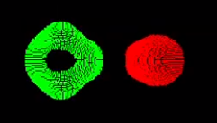

# Material Point Method

Simulation of deformable elastic bodies based on continuum mechanics.
This program was made using C++ and OpenGL compute shaders.
It also uses OpenGL for rendering and ImGui for GUI.

Video demo:
https://youtu.be/ziMCgmg7P3k

