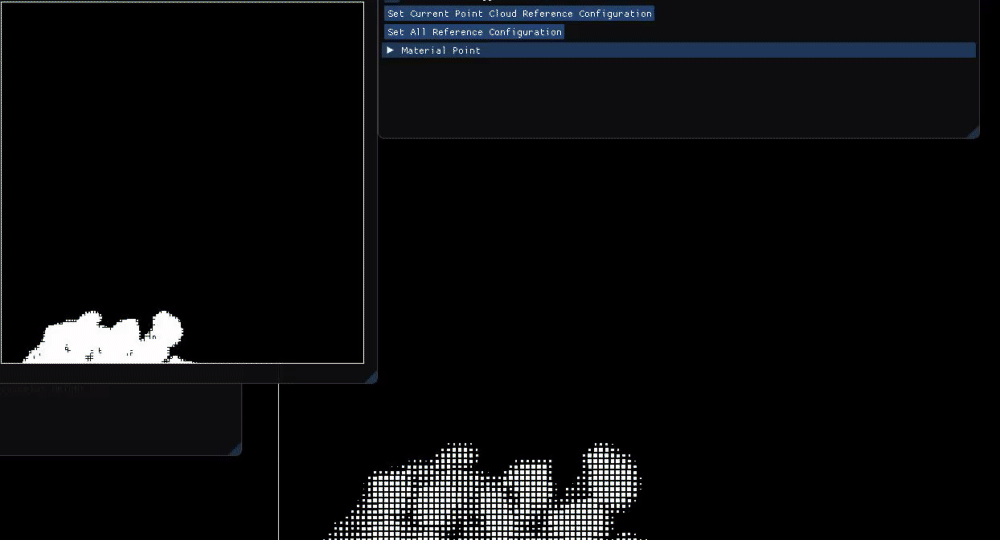

# Material Point Method C++ Tool

This program was made using C++ and OpenGL compute shaders.
It also uses OpenGL for rendering and ImGui for GUI.

Changing Reference Configuration Demo:
https://youtu.be/NqJg0TZ9T1s

Snow Demo:
https://youtu.be/BUgUbNJmPB8

Circle Tool Demo:
https://youtu.be/fhKNuo9MTek

Rendering points with elastic potential energy:

Rendering nodes by density and with elastic force vectors:

Rendering snow through node density (looks better this way than with points):

Material Point Method (MPM) is an Eulerian-Lagrangian hybrid algorithm for simulating continuum materials.

__Build Instructions for Windows__

Clone this repo, open MPM/MPM.vcxproj in Visual Studio 2019, and build. The project files are only configured for running in Debug x64 mode through Visual Studio right now. This program is using NVidia OpenGL extensions: GL_NV_shader_atomic_float64. A sufficient NVidia GPU that supports OpenGL 4.5 is required for the program to run properly (https://www.khronos.org/registry/OpenGL/extensions/NV/NV_shader_atomic_float64.txt).

__Resources on MPM:__

https://en.wikipedia.org/wiki/Material_point_method

https://www.seas.upenn.edu/~cffjiang/mpmcourse.html

__Resources on Continuum Physics:__

https://open.umich.edu/find/open-educational-resources/engineering/lectures-continuum-physics

Bonet, J. and Wood, R. (2008). Nonlinear continuum mechanics for finite element analysis. Cambridge University Press.

__MPM books I am reading:__

Fern, Elliot & Rohe, Alexander & Soga, Kenichi & Alonso, Eduardo. (2019). The Material Point Method for Geotechnical Engineering: A Practical Guide. 10.1201/9780429028090.

__Papers I have read:__

Alexey Stomakhin, Craig Schroeder, Lawrence Chai, Joseph Teran, and Andrew Selle. 2013. A material point method for snow simulation. ACM Trans. Graph. 32, 4, Article 102 (July 2013), 10 pages. DOI: https://doi.org/10.1145/2461912.2461948

Chenfanfu Jiang, Craig Schroeder, Joseph Teran, Alexey Stomakhin, and Andrew Selle. 2016. The material point method for simulating continuum materials. In ACM SIGGRAPH 2016 Courses (SIGGRAPH '16)

__Below are papers I am slowy reading, read enough relevant parts of, or plan to read in the future:__

__MPM papers:__

Ming Gao, Xinlei Wang, Kui Wu, Andre Pradhana, Eftychios Sifakis, Cem Yuksel, and Chenfanfu Jiang. 2018. GPU optimization of material point methods. ACM Trans. Graph. 37, 6, Article 254 (December 2018), 12 pages. DOI: https://doi.org/10.1145/3272127.3275044

The Material Point Method for the Physics-Based Simulation of Solids and Fluids, Chenfanfu Jiang, UCLA Computer Science Doctoral Dissertation (2015)

Steffen, M. , Kirby, R. M. and Berzins, M. (2008), Analysis and reduction of quadrature errors in the material point method (MPM). Int. J. Numer. Meth. Engng., 76: 922-948. doi:10.1002/nme.2360

__Math papers:__

T. Gast, C. Fu, C. Jiang, J. Teran, Implicit-shifted Symmetric QR Singular Value Decomposition of 3x3 Matrices. UCLA Mathematics Department Technical Report (CAM16-19, 2016).

__Constitutive Modelling papers:__

Alexey Stomakhin, Russell Howes, Craig Schroeder, and Joseph M. Teran. 2012. Energetically consistent invertible elasticity. In Proceedings of the 11th ACM SIGGRAPH / Eurographics conference on Computer Animation (EUROSCA'12), Dieter W. Fellner, Werner Hansmann, Werner Purgathofer, and François 
Sillion (Eds.). Eurographics Association, Aire-la-Ville, Switzerland, Switzerland, 25-32. DOI=http://dx.doi.org/10.2312/SCA/SCA12/025-032

Hongyi Xu, Funshing Sin, Yufeng Zhu, and Jernej Barbič. 2015. Nonlinear material design using principal stretches. ACM Trans. Graph. 34, 4, Article 75 (July 2015), 11 pages. DOI: https://doi.org/10.1145/2766917

Gergely Klár, Theodore Gast, Andre Pradhana, Chuyuan Fu, Craig Schroeder, Chenfanfu Jiang, and Joseph Teran. 2016. Drucker-prager elastoplasticity for sand animation. ACM Trans. Graph. 35, 4, Article 103 (July 2016), 12 pages. DOI: https://doi.org/10.1145/2897824.2925906

Gaume, Johan & Gast, Theodore & Teran, Joseph & van Herwijnen, Alec & Jiang, Chenfanfu. (2018). Dynamic anticrack propagation in snow. Nature Communications. 9. 10.1038/s41467-018-05181-w. 

