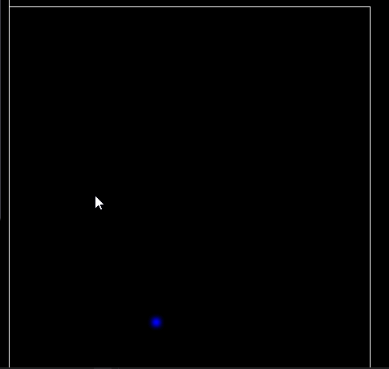

# Material Point Method C++ Tool

This program was made using C++ and OpenGL compute shaders.
It also uses OpenGL for rendering and ImGui for GUI.

__Video Gallery:__
https://www.youtube.com/channel/UC4qfNTQgecwtluc0M5HRnTw

__Gif Gallery:__
Rendering points with elastic potential energy:

Rendering nodes by density and with elastic force vectors:

Snow shear modulus reduction:

Material Point Method (MPM) is an Eulerian-Lagrangian hybrid algorithm for simulating continuum materials.

__Build Instructions for Windows__

Clone this repo, open MPM/MPM.vcxproj in Visual Studio 2019, and build. The project files are only configured for running in Debug x64 mode through Visual Studio right now. This program is using NVidia OpenGL extensions: GL_NV_shader_atomic_float64. A sufficient NVidia GPU that supports OpenGL 4.5 is required for the program to run properly (https://www.khronos.org/registry/OpenGL/extensions/NV/NV_shader_atomic_float64.txt).

__Introductory Resources on MPM:__

https://en.wikipedia.org/wiki/Material_point_method

https://www.seas.upenn.edu/~cffjiang/mpmcourse.html

__Introductory Resources on Continuum Physics:__

https://open.umich.edu/find/open-educational-resources/engineering/lectures-continuum-physics

Bonet, J. and Wood, R. (2008). Nonlinear continuum mechanics for finite element analysis. Cambridge University Press.

__Papers I have read:__

Alexey Stomakhin, Craig Schroeder, Lawrence Chai, Joseph Teran, and Andrew Selle. 2013. A material point method for snow simulation. ACM Trans. Graph. 32, 4, Article 102 (July 2013), 10 pages. DOI: https://doi.org/10.1145/2461912.2461948

Chenfanfu Jiang, Craig Schroeder, Joseph Teran, Alexey Stomakhin, and Andrew Selle. 2016. The material point method for simulating continuum materials. In ACM SIGGRAPH 2016 Courses (SIGGRAPH '16)

__Below are papers I am slowy reading, read enough relevant parts of, or plan to read in the future:__

__MPM in computer graphics:__
mpm.graphics

__MPM books:__

Fern, Elliot & Rohe, Alexander & Soga, Kenichi & Alonso, Eduardo. (2019). The Material Point Method for Geotechnical Engineering: A Practical Guide. 10.1201/9780429028090.

__Useful implementation references:__

T. Gast, C. Fu, C. Jiang, J. Teran, Implicit-shifted Symmetric QR Singular Value Decomposition of 3x3 Matrices. UCLA Mathematics Department Technical Report (CAM16-19, 2016).

Ming Gao, Xinlei Wang, Kui Wu, Andre Pradhana, Eftychios Sifakis, Cem Yuksel, and Chenfanfu Jiang. 2018. GPU optimization of material point methods. ACM Trans. Graph. 37, 6, Article 254 (December 2018), 12 pages. DOI: https://doi.org/10.1145/3272127.3275044