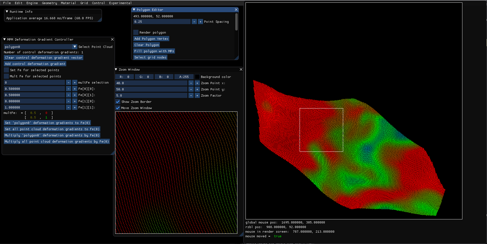
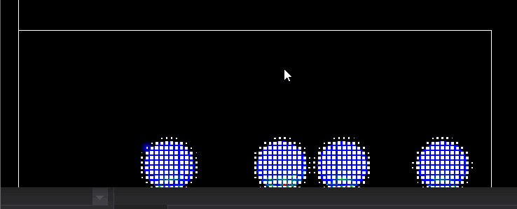
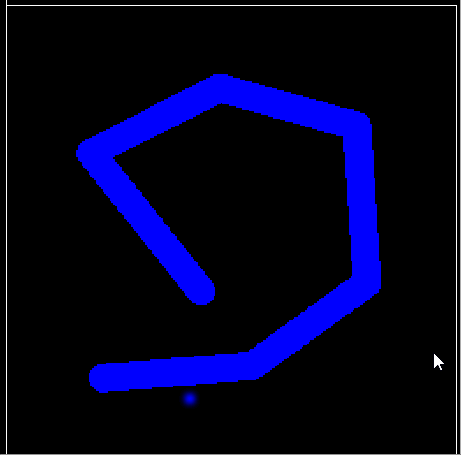
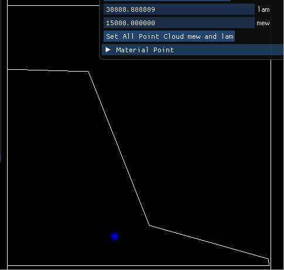

# Material Point Method C++ Tool

This program was made using C++ and OpenGL compute shaders.
It also uses OpenGL for rendering and ImGui for GUI.
I am using this program for my own research in physics-based animation.
I hope other users can also use this for their MPM needs or to just play around. Right now they would need to build it themselves, but I plan to release this as a standalone open-source software once I am happy with what I've done with it.

__Current Research (at UofT DGP):__ 
MPM control algorithms.
Natural triggers for landslides in MPM.

__Planned Features (in order of priority):__ 
-Implementations of my research (control and landslide triggers) 
-Implementation of MLS-MPM and CPIC 
-Advanced geometry editor to allow users to quickly create complex scenes to play with 
-Better material point selector (maybe a lasso tool) 
-Individual material point parameter control 
-rigid body, FEM, and mass-spring MPM coupling 
-level set collision objects 
-(jointed) rigid body characters to control with WASD and interact with the MPM world 
-3D mode 

__Development Plans:__ 
-make shader system more modular 
-runtime MPM structure modifications 
-change from GLSL to SPIR-V? 
-think about using Vulkan 

__Video Gallery:__ 
https://www.youtube.com/channel/UC4qfNTQgecwtluc0M5HRnTw 

__Nice GUI:__ 
 

__Gif Gallery:__ 
Rendering speed colored points vs marching squares for green fluid: 
 

Rendering points with elastic potential energy: 
 

Different grid sizes: 
 

Elastic deformation gradient modification (example 1) (colors are stress visualization): 
 

Elastic deformation gradient modification (example 2) (colors are speed visualization): 
 

Mathematical trigger for landslide (colors are speed visualization): 
 

Material Point Method (MPM) is an Eulerian-Lagrangian hybrid algorithm for simulating continuum materials.

__Build Instructions for Windows__ 
Clone this repo, open MPM/MPM.vcxproj in Visual Studio 2019, and build. This program is using NVidia OpenGL extensions: GL_NV_shader_atomic_float64. A sufficient NVidia GPU that supports OpenGL 4.5 is required for the program to run properly (https://www.khronos.org/registry/OpenGL/extensions/NV/NV_shader_atomic_float64.txt). Also, make sure your graphics drivers are up to date.

__Introductory Resources on MPM:__ 
https://en.wikipedia.org/wiki/Material_point_method

https://www.seas.upenn.edu/~cffjiang/mpmcourse.html

__Introductory Resources on Continuum Physics:__ 
https://open.umich.edu/find/open-educational-resources/engineering/lectures-continuum-physics

Bonet, J. and Wood, R. (2008). Nonlinear continuum mechanics for finite element analysis. Cambridge University Press.

__Papers implemented:__ 
Alexey Stomakhin, Craig Schroeder, Lawrence Chai, Joseph Teran, and Andrew Selle. 2013. A material point method for snow simulation. ACM Trans. Graph. 32, 4, Article 102 (July 2013), 10 pages. DOI: https://doi.org/10.1145/2461912.2461948

Chenfanfu Jiang, Craig Schroeder, Andrew Selle, Joseph Teran, and Alexey Stomakhin. 2015. The affine particle-in-cell method. ACM Trans. Graph. 34, 4, Article 51 (July 2015), 10 pages. DOI: https://doi.org/10.1145/2766996

Chenfanfu Jiang, Craig Schroeder, Joseph Teran, Alexey Stomakhin, and Andrew Selle. 2016. The material point method for simulating continuum materials. In ACM SIGGRAPH 2016 Courses (SIGGRAPH '16)

__Useful implementation references:__ 
T. Gast, C. Fu, C. Jiang, J. Teran, Implicit-shifted Symmetric QR Singular Value Decomposition of 3x3 Matrices. UCLA Mathematics Department Technical Report (CAM16-19, 2016).

Ming Gao, Xinlei Wang, Kui Wu, Andre Pradhana, Eftychios Sifakis, Cem Yuksel, and Chenfanfu Jiang. 2018. GPU optimization of material point methods. ACM Trans. Graph. 37, 6, Article 254 (December 2018), 12 pages. DOI: https://doi.org/10.1145/3272127.3275044

__MPM in computer graphics:__ 
https://www.seas.upenn.edu/~cffjiang/mpm.html

__MPM books:__ 
Fern, Elliot & Rohe, Alexander & Soga, Kenichi & Alonso, Eduardo. (2019). The Material Point Method for Geotechnical Engineering: A Practical Guide. 10.1201/9780429028090.

